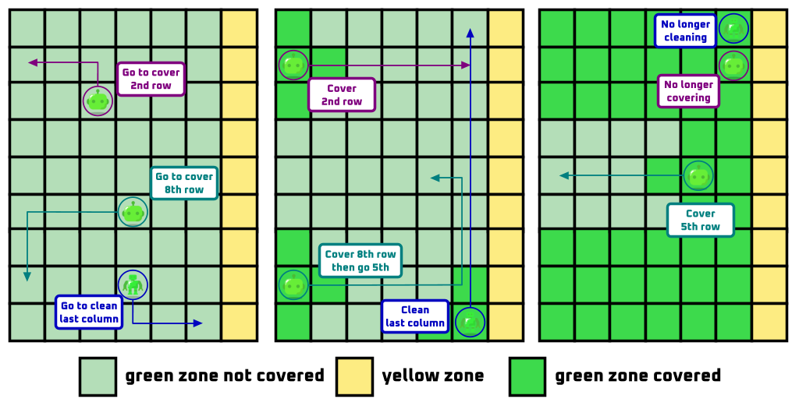
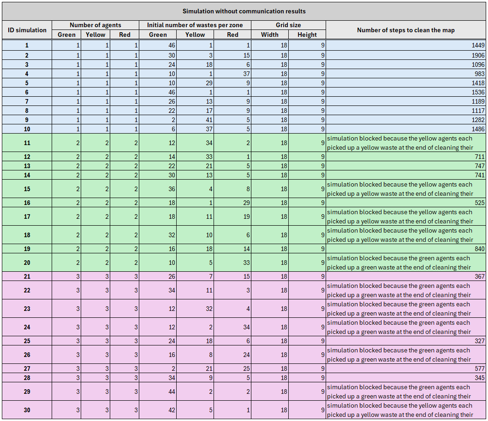

# Robot Mission - Group 3

This project has been created for the course SMA in CentraleSupélec.
The project has been realized by the group 3 composed of:
- Oumaima CHATER
- Laure-Emilie MARTIN
- Agathe PLU
- Agathe POULAIN

This `README` is composed of four main parts, the [first one](#installation) describing the steps to follow to install and run our code. The [second one](#without-communication) describes our implementation choices for non-communicating agent, whereas the [third one](#with-communication-and-improved-movement) deals with our implementation choices with communication between agents. The [fourth part](#simulations-results-interpretation) presents the results obtained for both approaches.

## PISTES D'AMELIORATION A REDIGER
- envoi de la part du chef d'un ordre pour indiquer l'endroit où drop un waste (le plus proche de l'agent) en se servant de sa knowledge et des communications du chef supérieur qui lui indique quand un déchet n'est plus là. Mettre dans knowledge un attribut drop_target_position et renommer target_position en pick_up_target_position.
- faire en sorte que les jaunes déposent leur déchet le plus proche possible de la waste disposal zone (pour éviter que les rouges aient des trop longs trajets à faire)
- beaucoup de messages envoyés, surtout de chef à agent mais ça c'est parce qu'il y a bcp d'ordres. On aurait pu demander aux agents d'arrêter d'envoyer leur percept et data au chef s'ils sont en mode stop.

## PERSPECTIVES FUTURES A REDIGER
- chef qui se casse => élection d'un nouveau chef (quand par exemple il ne répond plus aux messages envoyés par ses sous-fifres => message de confirmation à envoyer de la part du chef à chaque fois qu'il reçoit les percepts de ses sous-fifres)

## Table of contents

- [Robot Mission - Group 3](#robot-mission---group-3)
  - [PISTES D'AMELIORATION A REDIGER](#pistes-damelioration-a-rediger)
  - [PERSPECTIVES FUTURES A REDIGER](#perspectives-futures-a-rediger)
  - [Table of contents](#table-of-contents)
  - [Installation](#installation)
    - [Cloning the repository](#cloning-the-repository)
    - [Creation of a virtual environment](#creation-of-a-virtual-environment)
    - [Installation of the necessary librairies](#installation-of-the-necessary-librairies)
    - [Launch the code](#launch-the-code)
  - [Our Objects](#our-objects)
    - [The Radioactivity](#the-radioactivity)
    - [The Waste](#the-waste)
    - [The WasteDisposalZone](#the-wastedisposalzone)
  - [Without Communication](#without-communication)
    - [Our Agents](#our-agents)
      - [The agent's knowledge](#the-agents-knowledge)
      - [The CleaningAgent](#the-cleaningagent)
      - [The GreenAgent](#the-greenagent)
        - [The deliberate method](#the-deliberate-method)
      - [The YellowAgent](#the-yellowagent)
        - [The deliberate method](#the-deliberate-method-1)
      - [The RedAgent](#the-redagent)
        - [The deliberate method](#the-deliberate-method-2)
    - [Our Model](#our-model)
    - [The scheduler](#the-scheduler)
    - [The visualization](#the-visualization)
  - [With Communication and improved movement](#with-communication-and-improved-movement)
    - [The knowledge](#the-knowledge)
      - [The Agent's knowledge](#the-agents-knowledge-1)
      - [The Chief's knowledge](#the-chiefs-knowledge)
    - [The agents](#the-agents)
      - [The CleaningAgent](#the-cleaningagent-1)
      - [The GreenAgent](#the-greenagent-1)
        - [The deliberate method](#the-deliberate-method-3)
      - [The YellowAgent](#the-yellowagent-1)
        - [The deliberate method](#the-deliberate-method-4)
      - [The RedAgent](#the-redagent-1)
        - [The deliberate method](#the-deliberate-method-5)
      - [The Chief](#the-chief)
      - [The ChiefGreenAgent](#the-chiefgreenagent)
      - [The ChiefYellowAgent](#the-chiefyellowagent)
      - [The ChiefRedAgent](#the-chiefredagent)
    - [Our Model](#our-model-1)
    - [The scheduler](#the-scheduler-1)
    - [The visualization](#the-visualization-1)
  - [Simulation's results interpretation](#simulations-results-interpretation)
    - [Without communication](#without-communication-1)
    - [With communication and improved movement](#with-communication-and-improved-movement-1)


## Installation

### Cloning the repository

To clone the github repository, you have to search the clone button on the main page of the project. Then click on it and select `https` or `ssh` depending on your favorite mode of connexion. Copy the given id and then open a terminal on your computer, go to the folder where you want to install the project and use the following command:

```bash
git clone <your copied content>
```

### Creation of a virtual environment

You might want to use a virtual environment to execute the code. To do so, use the following command:

```bash
python -m virtualenv venv
```

To start it, use the command on *Windows*:

```bash
./venv/Scripts/Activate.ps1
```

Or for *MacOS* and *Linux*:

```bash
source venv/Scripts/activate
```

### Installation of the necessary librairies

To execute this software, you need several *Python* librairies, specified in the `requirements.txt` file. To install them, use the following command:

```bash
pip install -r requirements.txt
```

### Launch the code

The grid size and the waste density are defined and can be modified in `tools/tools_constants.py`.


The main code can be launched by running the following command:

```bash
python run.py
```

It can also be launched with the visualisation by running the following command:

```bash
python server.py
```

## Our Objects

Our objects are agent types without any behaviour, and they are defined in `objects.py`.

### The Radioactivity

The `Radioactivity` object represents the radioactivity of an area. It has two attributes:
- `zone`, which defines the area it belongs to and can only take three values ("z1", "z2", "z3")
- `radioactivity_level`, which defines its level of radioactivity. It is a random number comprised between 0 and 0.33 for z1, 0.33 and 0.66 for z2 and 0.66 and 1 for z3.

The `Radioactivity` object is placed in each cell of the grid to define our different areas. Its `zone` attribute then is used by our agents to determine which zone they are in.

### The Waste 

The `Waste` object represents the waste. It has one attribute: `type_waste` which defines the type of the waste and can only take three values ("green", "yellow", "red"). 

### The WasteDisposalZone

The `WasteDisposalZone` object represents a cell in the last right column of the grid, chosen randomly from the cells in that column.


## Without Communication

### Our Agents

The implementation of our different cleaning agents is in the `agents.py` file.

#### The agent's knowledge

The `AgentKnowledge` class represents the knowledge and state of an agent in the simulation. This class is defined in `tools/tools_knowledge.py`. It has the following attributes:

- `grid_knowledge`: Represents the agent's knowledge of the grid. Its values are set to `0` for an empty tile, `1` for a green waste, `2` for a yellow waste, `3` for a red waste and `4` for the waste disposal zone. It is a numpy array with the same dimensions as the grid.
- `grid_radioactivity`: Represents the agent's knowledge of the grid's radioactivity. Its values are set to `1`, `2` or `3` according to the different zones. It is a numpy array with the same dimensions as the grid.
- `picked_up_wastes`: Represents a list of the Waste agents that our cleaning agent has picked up.
- `transformed_waste`: Represents whether the agent has transformed waste. Its values are `None` or the new transformed waste object.
- `left`, `right`, `up`, `down`: Boolean variables representing the possibility for the agent to move in the corresponding direction. It depends on the presence of an other agent in the agent's surrounding cells and on the limits of the grid.

The class provides methods to get and set these attributes. The __str__ method provides a string representation of the object's state.

#### The CleaningAgent

The `CleaningAgent` class inherits from the Mesa `Agent` class and is used to define common behaviors for the Green, Yellow and Red cleaning agents. These common behaviors are the methods `step`, `convert_pos_to_tile`, `update`, `update_positions_around_agent` and `update_knowledge_with_action`.

The `step` method implements the procedural loop of our agent. It begins by updating the agent's knowledge using the `update` method. Next, the `deliberate` method is called to return a list of possible actions. Finally, the `do` method is invoked in the environment to execute the chosen action.

The `convert_pos_to_tile` method takes as input a position and returns a direction (`left`, `right`, `up` or `down`) based on the agent's current location relative to the input position.

The `update` method updates each attributes of the agent's knowledge according to the percept.

The `update_positions_around_agent` method is used in the `update` method to update `left`, `right`, `up` and `down` boolean values of the agent's knowledge.

The `update_knowledge_with_action` method is used in the `update` method to update the knowledge of the agent given the action it has performed on the previous step. For instance, if the agent has transformed a waste, `transformed_waste` will be set to the transformed created waste contained the `percepts` returned by the model.

#### The GreenAgent

The `GreenAgent` is a class inheriting from the class `CleaningAgent` presented above. It permits to code the specific behavior of the green agent, mainly the `deliberate` method, which is not the same for all types of cleaning agents.

##### The deliberate method

The `deliberate` method returns a list of actions called `list_possible_actions`, in the order of preference for the agent. Only one will be executed by the model, the first of the list which can be executed.

The actions have been defined in `tools_constants` by strings. Here is the full list:
- `ACT_TRANSFORM`, to transform two wastes in a waste from the superior color
- `ACT_PICK_UP`, to pick up a waste
- `ACT_DROP`, to drop a transformed waste
- `ACT_GO_LEFT`, to go left
- `ACT_GO_RIGHT`, to go right
- `ACT_GO_UP`, to go up
- `ACT_GO_DOWN`, to go down
- `ACT_WAIT`, to wait

If the agent possesses two green wastes, the top priority action is to transform them.

If the agent possesses a yellow transformed waste, it will ask to go right until its right tile is on zone 2, ie the border. When it is on the border, it will ask to drop its waste if the current tile is empty, otherwise it will go up or down randomly, if nothing is blocking its way (thanks to the attributes `up` and `down` from knowledge). 

If the agent is on a tile with a green waste and if it doesn't have two wastes or a transformed waste, it will ask to perform the pick up action. If it can't move or drop its waste, it will wait.

If the agent has less than two picked up wastes, no transformed waste and is on a cell containing a waste, then it will pick up the waste.

Otherwise, we will add moving to different directions if nothing blocks its way to its list of possible actions. We will favor adjacent cells with waste by adding them first in its list. Otherwise, possible directions are added in a random order.

The last action of the list will be to wait, so the agent always has an action to preform.

#### The YellowAgent

The `YellowAgent` is a class inheriting from the class `CleaningAgent` presented above. It permits to code the specific behavior of the yellow agent, mainly the `deliberate` method, which is not the same for all types of cleaning agents.

##### The deliberate method

It has the same behavior as the GreenAgent's deliberate method. One of the few differences is that it can move to the green area to pick up yellow waste at the border.

#### The RedAgent

The `RedAgent` is a class inheriting from the class `CleaningAgent` presented above. It permits to code the specific behavior of the red agent, mainly the `deliberate` method, which is not the same for all types of cleaning agents.

##### The deliberate method

This method's behavior is still quite similar to the tow other agents' deliberate methods. However, the red agents won't transform wastes, they will only pick up one waste and then put it in the waste disposal zone. To do so, it will go right after picking up a waste and then move up or down to join the waste disposal zone whose position is stored in the agent's knowledge.

### Our Model

The implementation of our model is in the `model.py` file. The `RobotMission` class inherits from the Mesa `Model` class and defines the RobotMission model itself, and uses the agents, the scheduler and the environment. 

We begin by defining several methods to set up the grid and all agents: `init_grid`, `init_wastes` and `init_agents`.

TODO - Agathe Poulain => expliquer le datacollector

In `init_grid` we establish the position of the waste disposal zone and created  `Radioactivity` objects in every cells of the grid except at the waste disposal zone position, where we created a `WasteDisposalZone` object.

In `init_wastes` we create all wastes. To do so, we first define the total number of wastes in the grid (grid height * grid width * waste density, the density is set in `tools/tools_constants.py`) and the number of cells per zone (grid width/3 * grid height). We then randomly place green, yellow and red wastes in their respective zones. However, we do not initially place a red waste in the waste disposal zone.

- The number of green wastes is randomly determined within a range. The upper bound of this range is the minimum between the number of cells in the green area and the total number of wastes. The lower bound is the maximum between 0 and the total number of waste minus the total number of cells in the rest of the grid. This allocation ensures that wastes are placed in the zone if the other two areas do not have sufficient space to accommodate all remaining wastes. Then we check if that number is even so that we can clean the whole map. Otherwise we add or subtract one green waste.

- The number of yellow wastes is randomly determined within a range. The upper bound of this range is the maximum between 0 and the minimum between the remaining wastes and the number of cells in the zone. The lower bound is the maximum between 0 and the total number of waste minus the total number of cells in the rest of the grid. This allocation ensures that waste can be placed in the zone if the red area does not have sufficient space to accommodate all remaining wastes. Then we check if that number plus the number of green wastes' pairs is even, otherwise we add or subtract one yellow waste.

- The number of red wastes is determined by the number of remaining wastes to place.

In `init_agents` we create and place the cleaning agent according to their colors and respective areas. We choose to initially place cleaning agent in their color zone. We also do not allow two agents to be in the same cell, this will stay true during the simulations.

The `step` method does the scheduler step while there are still wastes to clean up, otherwise the simulation will terminate.

The `run_model` method executes the `step` method for a given number of sSteps.

The `do` method takes as arguments the agent performing the action and the list of all possible actions. It iterates through this list, checking if the current action is feasible. If it is feasible, the method breaks, ensuring that only one action is performed. If the current action is not feasible, the method moves on to the next action in the list. When an action is performed using the `do` method, the method also executes the changes associated with that action:
- `ACT_TRANSFORM`, if the agent is a `GreenAgent` it creates a green waste, if the agent is a `YellowAgent` it creates a red waste. It then adds the transformed created waste to the scheduler. It also removes from the scheduler the two wastes from the agent's knowledge `picked_up_waste`.
- `ACT_PICK_UP`, it removes the waste agent from the grid.
- `ACT_DROP`, if the agent is not a `RedAgent` the transformed waste will be placed on the grid. If the agent is a `RedAgent` it will remove the picked_up_waste from the scheduler.
- `ACT_GO_LEFT`, it will check for another agent in the left cell and move the agent if it is empty.
- `ACT_GO_RIGHT`, it will check for another agent in the right cell and move the agent if it is empty.
- `ACT_GO_UP`, it will check for another agent in the upper cell and move the agent if it is empty.
- `ACT_GO_DOWN`, it will check for another agent in the lower cell and move the agent if it is empty.
- `ACT_WAIT`, it waits.

The `do` method returns the percepts. It is a dictionary of two mains keys: `action_done` and `positions`. The first key is associated with a dictionary containing the key `action` associated to the constant representing the action executed and `object` if the agent has picked up a waste or transformed it. The second key is a dictionary with four keys: left, right, up and down. It either contains a list of agents (`Waste`, `Radioactivity`, other cleaning agents and `WasteDisposalZone`) in the surrounding cells or `None` if the cell does not exist (grid limits). This percepts is created after the action is performed to take into account the possible new position of the agent.

### The scheduler

A custom class of random scheduler `CustomRandomScheduler` has been defined in the file `schedule.py`. This new class inherits from the base class of *mesa* `BaseScheduler`, but its `step()` function is slightly modified to activate the cleaning agents in a random order, according to their type. More precisely, the order of activation of the types of agents is random (random between green, yellow and red), and for each type, the order of activation of agents is random.

### The visualization

The visualization is defined in the `server.py`. Each agent and object is there represented according to the following codes:
- the `Radioactivity` objects are rectangles in the layer 0 in the corresponding color (light green, light yellow, light red): they map the grid.
- the `WasteDisposalZone` object is a brown rectangle in the layer 1.
- the `Waste` objects are small rectangles in the corresponding color (green, yellow, red), in the layer 2.
- the `CleaningAgent` are represented by circles in the layer 3 in the corresponding colo  (dark green, dark yellow, dark red). When they have one or two wastes on them, the number of wastes is display in the circle. When they have a transformed waste on them, the letter "T" is displayed in the circle.

## With Communication and improved movement

We worked from the previous part to add communication between our agent and we improved their movement. In this new part, we will develop all implemented changes and enhancements.

The key points are the covering mode at the beginning of the cleaning to identify all wastes in the map, and the creation of a Chief for each color agents. This Chief is in charge of centering the knowledge (for each color agents), managing its agents for the new covering phase and sending appropriate orders. For this purpose, we create a new super class `Chief` and we create a dedicated `ChiefKnowledge` class in `tools/tools_knowledge.py`. We will now delve into our implemented improvements: the code is based on the previous part, hence, we will only mention deleted, changed and/or added behaviors in this part.

### The knowledge

For our communication, we choose to extend our agents' knowledge by incorporating additional elements. We also created a dedicated `ChiefAgentKnowledge` class inheriting from our `AgentKnowledge` class.

#### The Agent's knowledge

We added several attributes to our inital `AgentKnowledge` class, including:

- `dict_chiefs` : A dictionary containing the chief agents for each color.
- `target_position` : Represents the target position to reach, which can be None or a position tuple.
- `bool_covering` : Boolean variable representing whether the agent is in covering mode or not, initialized at `True`.
- `direction_covering` : Represents the direction to cover, initialized at `None` and can take values `right` or `left`.

#### The Chief's knowledge

The `ChiefAgentKnowledge` class inherits from the `AgentKnowledge` class and includes additional attributes:

- `dict_agents_knowledge` : A dictionary containing the agents' knowledge.
- `bool_cleaned_right_column` : Boolean variable representing whether the Chief's zone's rightmost column has been cleaned. Indeed, the green and yellow chiefs will start cleaning the rightmost column of their zone, in order to allow easier drop of transformed waste on the border.
- `direction_clean_right_column` : Represents the direction to clean, initialized at `None` and can take values `up` or `down`.
- `rows_being_covered` : A list of size equal to the grid height, containing 0 if the row is being covered or has been covered, and 1 otherwise.
- `list_green_yellow_red_left_columns` : A list of three values, initialized at `None`, representing the columns of the leftmost columns in the green, yellow, and red zones.
- `list_green_yellow_red_right_columns` :  A list of three values, initialized at `None`, representing the columns of the rightmost columns in the green, yellow, and red zones.
- `dict_target_position_agent` : A dictionary containing the target positions given to each agent.

The class provides methods to get and set these attributes. The __str__ method provides a string representation of the object's state.

### The agents

The principle beyond the behavior of each agent given its type (chief or not) and its color is the following:
- at the beginning of the simulation, the green and yellow chiefs are on the rightmost column of their zone to clean it, to allow easier drop of the transformed wastes. The other agents (the red chief including) will start cover their own zone, so each tile of their zone has been seen at least once. It will been done accordingly to the following image.

Each agent will place himself to the target position indicated by the chief to perform the coverage of the row (and the two adjacent rows at the same time); this row is chosen to be the closest non covered row to the agent. The agents performing the coverage can pick up wastes during their covering if the waste is on their way. Nevertheless, they cannot derive from their row and their target position to pick a close waste or drop a transformed waste (they can drop it only if their way to go to their cover target is on the last column, which is not always the case). 
- after all rows being covered, the agents will receive new orders from the chief, indicating the position of the closest waste to the agent (the chief will also receive this kind of orders from himself). The agent will thus go to this target; if he finds a waste on his way, he can pick it and warn the chief of this action. When the agent has a transformed waste, he goes right (and indicates the chief he cancels his target if he had still one) to drop it on the last column. This principle is the same for red agents with the waste disposal zone.
- at the end of the cleaning of the green or yellow zone, some blocking situations can exist. For instance, if the two last green wastes have been picked up by different agents. To overcome this dead-end, we added a special action `ACT_DROP_ONE_WASTE` and we used communication; the chief will a message to one of the agents to drop its waste and let the other agent pick it.

#### The CleaningAgent

The `CleaningAgent` class inherits from the `CommunicatingAgent` class defined in `communication/agent/CommunicatingAgent.py` and is used to define common behaviors for the Green, Yellow and Red cleaning agents and their chiefs. These common behaviors are the methods `step`, `convert_pos_to_tile` (same as part 1), `treat_order`, `receive_orders`, `get_specificities_type_agent`, `can_drop_transformed_waste`, `can_drop_one_waste`, `can_transform`, `can_pick_up`, `can_go_up`, `can_go_down`, `can_go_right`, `can_go_left`, `deliberate_go_to_pick_close_waste`, `deliberate_go_to_target`, `send_message_disable_target_position`, `update_knowledge_target_position`, `update_knowledge_with_action`, `update` and `send_percepts_and_data`.

In the `step` method, we implement the improved procedural loop of our agent. We start by receiving orders from the chief with `receive_orders`. We then call the `deliberate` and `do` methods, followed by the `update` method. Finally, the step is finished by the agent sending its percept and data to the chief using `send_percepts_and_data`. We chose to move the `update` method after the `deliberate` and `do` methods as this new order best fits our implementation and our needs.

The `treat_order` method defines the agent's action corresponding to received orders from its chief. The message reception of the agent is defined in the `receive_orders` method.

The `get_specificities_type_agent` method is widely used in our code as it returns specific values depending on the agent's type (i.e., its color). It returns the maximum number of waste items that can be picked up (2 for green and yellow, 1 for red agents), the type of waste that can be picked up (1 for green, 2 for yellow, 3 for red agents), and the type of the right (2 for green, 3 for yellow and None for red agents) and left (None for green, 1 for yellow and 2 for red agents) zones for the agent.

The methods `can_drop_transformed_waste`, `can_drop_one_waste`, `can_transform`, `can_pick_up`, `can_go_up`, `can_go_down`, `can_go_right`, `can_go_left` each return a boolean value indicating whether the agent can perform the corresponding action. We verify all conditions in these functions and define them to simplify and clean our code.  We use them in various ♠`deliberate` functions in our program.

The `deliberate_go_to_pick_close_waste` method in the `CleaningAgent` class is designed to prioritize movement towards the nearest waste, according to the type of waste the agent is designed to pick up. This method plays a crucial role in optimizing the agent's cleaning efficiency by identifying the most strategic direction to move next, based on the proximity of waste suitable for collection.
Initially, the method assesses the agent's surroundings by examining the grid's current state and identifies the agent's specific waste type to collect. It then compiles a list of possible movement directions (`ACT_GO_RIGHT`, `ACT_GO_LEFT`, `ACT_GO_UP`, `ACT_GO_DOWN`) based on the agent's capacity to move in each direction without obstruction.
For each potential direction, the method evaluates whether moving in that direction will bring the agent closer to its target waste type. If a particular direction leads directly to a cell containing the appropriate type of waste, that direction is prioritized and added to a list of 'best directions.' These preferred directions signify the most efficient paths for waste collection, directly aligning with the agent's objective to clean the environment effectively.
After determining the best directions for waste collection, the method randomizes the order of these preferred paths. This randomization introduces variability in the agent's movement pattern, preventing deterministic behavior and potentially allowing for more thorough area coverage over time. The final list of shuffled best directions is then returned, providing the agent with a prioritized yet varied set of movements to execute in pursuit of nearby waste.


The `deliberate_go_to_target` method in the `CleaningAgent` class is instrumental in guiding an agent toward a designated target location, effectively melding the agent's strategic planning with its environmental awareness. This method extracts essential information from the agent's knowledge base, such as its current and target positions, and a boolean flag indicating if the agent is in covering mode. Utilizing this data, it ascertains a suite of potential actions that could bring the agent closer to its target.
Priority is given to actions that do not hinder the agent's movement towards the target, including dropping transformed waste, collecting waste, converting waste, or dropping a single waste item—this last action being exclusive to Red agents. These actions are considered on the fly and can be executed while the agent moves toward its goal. If the agent is not engaged in covering, it may also consider collecting nearby waste as a part of its possible actions.
For navigation, the method evaluates the relative location of the target compared to the agent's current position. It then decides on the appropriate directional movements needed to reach the target, adding actions like `ACT_GO_RIGHT`, `ACT_GO_LEFT`, `ACT_GO_UP`, or `ACT_GO_DOWN` to the list of potential actions based on the target's direction. These calculated movements are aimed at efficiently steering the agent towards its target, ensuring the agent's activities align with its environmental objectives and constraints, be it waste management, waste transformation, or specific grid navigation.


The `send_message_disable_target_position` methods is defined to allow the agent to notify its chief when it decides to not pursue its assigned target position. This can append in normal mode if the agent now has a transformed waste to drop, for instance.

The `update_knowledge_target_position` method within the `CleaningAgent` class is designed to adjust the agent's understanding and strategic planning in relation to its current objective or target position, especially within the context of covering or cleaning specific areas. This method dynamically updates the agent's target position and direction based on its current location and the status of its objectives.
At the core of this method is the evaluation of whether the agent has reached its target position. If the agent has arrived at the specified target position—or if the target position was defined in terms of the y-axis only and this has been reached—the method proceeds to adjust the agent's covering direction if it is in covering mode. This adjustment is based on the agent's position relative to the grid's radioactivity zones, which delineate different areas of the grid for specific types of agents. If the agent finds itself at the edge of its designated zone, or if it has reached the target position, it sets a new direction to cover next—either "left" or "right," depending on its current position and the layout of the radioactivity zones.
If the agent has not reached its target position, but it is in covering mode and has completed a line of coverage, the method evaluates whether it needs to reset its covering direction. This might happen if the agent reaches the grid's boundary or completes coverage of a specific area, necessitating a change in its approach to efficiently continue its task.
This dynamic reassessment and updating of the agent's goals and strategies are crucial for maintaining flexibility and efficiency in its operations. By continuously adapting its target position and direction based on its progress and the environment's layout, the agent can effectively navigate the grid, cover areas as needed, and fulfill its cleaning duties.


The `update_knowledge_with_action` method defines which attributes to update in the agent's knowledge depending on the action it has performed. The `update` method update the agent's knowledge based on the agent's percepts after performing its action. At the end of the step, the `send_percepts_and_data` method is used by the agent to send its latest percepts and knowledge to its chief

#### The GreenAgent
As presented for the part without communication,the `GreenAgent` is a class inheriting from the class `CleaningAgent` presented above. It permits to code the specific behavior of the green agent, mainly the `deliberate` method, which is not the same for all types of cleaning agents.
##### The deliberate method
The `deliberate` method returns a list of actions called `list_possible_actions`, in the order of preference for the agent. Only one will be executed by the model, the first of the list which can be executed.

The actions have been defined in `tools_constants` by strings. Here is the full list:

- `ACT_TRANSFORM`, to transform two wastes in a waste from the superior color
- `ACT_PICK_UP`, to pick up a waste
- `ACT_DROP`, to drop a transformed waste
- `ACT_GO_LEFT`, to go left
- `ACT_GO_RIGHT`, to go right
- `ACT_GO_UP`, to go up
- `ACT_GO_DOWN`, to go down
- `ACT_WAIT`, to wait

If the agent possesses two green wastes, the top priority action is to transform them.

If the agent possesses a yellow transformed waste, it will ask to go right until its right tile is on zone 2, i.e. the border. When it is on the border, it will ask to drop its waste if the current tile is empty, otherwise it will go up or down randomly, if nothing is blocking its way (thanks to the attributes `up` and `down` from knowledge).

If the agent is on a tile with a green waste and if it doesn't have two wastes or a transformed waste, it will ask to perform the pick-up action. If it can't move or drop its waste, it will wait.

If the agent has less than two picked up wastes, no transformed waste and is on a cell containing a waste, then it will pick up the waste.

Otherwise, we will add moving to different directions if nothing blocks its way to its list of possible actions. We will favor adjacent cells with waste by adding them first in its list. Otherwise, possible directions are added in a random order.

The last action of the list will be to wait, so the agent always has an action to perform.

#### The YellowAgent

The `YellowAgent` is a class inheriting from the class `CleaningAgent`. This class is designed to specify the behavior of the yellow agent, particularly implementing the `deliberate` method, which differs among various types of cleaning agents.

##### The deliberate method

The `deliberate` method generates a list of actions known as `list_possible_actions`, arranged in the order of the agent's preference. The model will execute only one action—the first on the list that can be performed.

The actions are defined in `tools_constants` as strings, including:

- `ACT_TRANSFORM` to transform two wastes into one of a superior color
- `ACT_PICK_UP` to collect waste
- `ACT_DROP` to dispose of transformed waste
- `ACT_GO_LEFT` to move left
- `ACT_GO_RIGHT` to move right
- `ACT_GO_UP` to move up
- `ACT_GO_DOWN` to move down
- `ACT_WAIT` to pause action

Priority actions for the YellowAgent are as follows:

- If the agent has two yellow wastes, it prioritizes transforming them.
- With a yellow transformed waste, it moves right until reaching the border (zone 3). If the current tile is empty, it will drop the waste; otherwise, it will randomly move up or down if unobstructed, as determined by `up` and `down` knowledge attributes.
- When positioned on a tile with a yellow waste and lacking two wastes or a transformed one, it will opt to pick up the waste. If unable to move or drop the waste, it waits.
- Should the agent have fewer than two collected wastes, no transformed waste, and is on a tile with waste, it will collect the waste.
- In the absence of blockages, the agent will add moving to various directions to its list of potential actions, prioritizing adjacent cells containing waste. Otherwise, directions are randomized in order.
- The final action listed is always to wait, ensuring the agent has a constant action available.


#### The RedAgent

The `RedAgent` class inherits from the `CleaningAgent` class, tailored specifically to define the red agent's behavior, particularly through its unique `deliberate` method.

##### The deliberate method

This method constructs a sequence of potential actions, designated as `list_possible_actions`, ordered according to the agent's programmed preferences. Only the foremost executable action in the list will be carried out by the model.

The actions are defined within `tools_constants` using string identifiers. These actions encompass:

- `ACT_TRANSFORM`, which converts two pieces of waste into a higher-tier waste
- `ACT_PICK_UP`, to collect waste
- `ACT_DROP`, to dispose of transformed waste
- `ACT_GO_LEFT`, to move leftward
- `ACT_GO_RIGHT`, for rightward movement
- `ACT_GO_UP`, to ascend
- `ACT_GO_DOWN`, to descend
- `ACT_WAIT`, for inaction

The RedAgent prioritizes actions in the following manner:

- It seeks to transform two red wastes into a superior waste form when possible.
- If it holds a transformed red waste, it will strive to move right towards the disposal area, zone 4. The agent will dispose of the waste if the current cell is unoccupied; otherwise, it moves vertically if there's no obstacle, according to the `up` and `down` attributes of its knowledge base.
- When on a cell with a red waste, without possessing two wastes or a transformed one, the agent will opt to collect the waste. If unable to move or drop the waste, the agent defaults to waiting.
- If the agent has fewer than two collected wastes, no transformed waste, and is on a cell with waste, it will engage in waste collection.
- If not obstructed, the agent will consider moving in various directions, favoring cells with waste nearby. If no specific pattern is established, the directions are determined randomly.
- The concluding action on the list is invariably to wait, ensuring that the agent has a consistent action to perform.


#### The Chief

The `Chief` class extends the `CleaningAgent` class, forming the central command unit for coordinating cleaning agents within the simulation environment. It encapsulates methods necessary for orchestrating the agents' collective efforts in maintaining grid cleanliness and waste disposal efficiency.

The chief's cycle of operations is orchestrated through the `step` method. This method sequentially initiates the reception of messages via `receive_messages`, updates the chief's knowledge with the agents' percepts through `update_chief_with_agents_knowledge`, sends relevant information to the superior chief using `send_information_according_to_previous_actions`, updates its own knowledge with other chiefs' input with `update_chief_information_knowledge`, and issues directives to its subordinate agents via `send_orders`. Upon self-reception of these orders through `receive_orders`, the chief utilizes `deliberate` to determine its potential actions, followed by the execution of said actions and the updating of percepts. The operational cycle concludes with the `update` method.

Specific functions within the Chief class are tasked with particular operational roles:

- `receive_messages` for processing incoming communications.
- `determine_covering` for deciding on coverage actions in the absence of subordinate agents.
- `update_chief_with_agents_knowledge` and `update_chief_information_knowledge` for knowledge acquisition and synthesis.
- `send_information_according_to_previous_actions` for disseminating action-based information.
- `send_orders_covering`, `send_target_orders`, and `deliberate_cover_last_column` for strategizing and issuing orders related to grid coverage and waste disposal.
- `update` for assimilating the results of performed actions into the chief's knowledge base.
  
These specialized methods are utilized to maintain a structured approach to grid management, ensuring that each waste item is accounted for and appropriately disposed of, while also directing the agents in a manner that optimizes their cleaning routes and actions.


#### The ChiefGreenAgent

The `ChiefGreenAgent` class is a specialized Chief agent tailored to manage Green agents within the simulation. This class inherits from both the `Chief` and `GreenAgent` classes, combining the leadership role of the Chief with the GreenAgent's specific behavior.

The ChiefGreenAgent's role is to oversee Green agents, guiding them in environmental maintenance and waste disposal tasks. The initialization method sets up the ChiefGreenAgent with unique identifiers and situational awareness of the grid it operates within.

Upon initialization, the ChiefGreenAgent is defined as not covering any particular zone, indicating its primary role is to coordinate rather than directly engage in the coverage of the grid. This is signified by the attribute `set_bool_covering` being set to `False`. This agent is thus primarily responsible for the strategic direction of Green agents under its command.


#### The ChiefYellowAgent

The `ChiefYellowAgent` class is a distinct type of Chief agent specifically designed to command Yellow agents in the simulation. As a subclass of both `Chief` and `YellowAgent`, it holds the command functions of a Chief while also encapsulating the unique attributes of a YellowAgent.

The ChiefYellowAgent's purpose is to direct Yellow agents through tasks related to environmental cleaning and waste management. It is equipped with a unique identifier and an understanding of the grid's layout, which is essential for efficient coordination and decision-making.

Upon instantiation, the ChiefYellowAgent is not assigned any coverage responsibilities, as indicated by the property `set_bool_covering` being initialized to `False`. This configuration emphasizes its role as a coordinator, focusing on the management and operational guidance of Yellow agents, rather than direct participation in grid coverage.


#### The ChiefRedAgent

The `ChiefRedAgent` class integrates the responsibilities of a Chief with the attributes of a RedAgent, managing Red agents within the simulated environment. This class inherits from both the `Chief` and `RedAgent` classes, empowering it to oversee and command Red agents.

As the leader of Red agents, the ChiefRedAgent is established with a unique identity and a comprehensive layout of the grid, which facilitates effective command and logistical planning of cleaning tasks.

The ChiefRedAgent is initialized with a distinction in its role: unlike the Green and Yellow Chief agents, it does not bear the responsibility of cleaning the last column of the grid. This is denoted by setting the `set_bool_cleaned_right_column` property to `True` during its initiation. This special designation underscores the agent's primary focus on leadership and strategic oversight, deviating from direct cleaning duties often associated with the chiefs of other agent colors.


### Our Model

We improved a few things in the model class. 

First of all, we took into account the configurations where the grid width is not divisible by 3. In these cases, we attributed the one or two columns remaining to one or two zones randomly. For instance, for a grid width of 20, the green zone can have 7 columns, the yellow 6 and the red 7, at random.

Moreover, we implemented the `MessageService` class to enable the communication between agents.

### The scheduler

We improved the class `CustomRandomScheduler` by adding the chiefs in the `step` method. We choose to call the chiefs before the agents of their respecting colors, to allow them to distribute orders always at the beginning of the step.

### The visualization

We improved the visualization by adding *mesa* sliders to enable the user to configure the simulation directly on the interface. The user can choose the number of green, yellow and red agents, and also the waste density.

We also added clearer images for each type of object. We distinguished chiefs from agent for each color with specific images, and we also chose an image for the wastes and the waste disposal zone. All of these images are located in the folder `resources/`.

## Simulation's results interpretation

To compare both approaches presented above, mostly to analyse the improvements made in the second method, we decided to run many simulations for both cases and compare the terminating rate of simulations (for non communication approaches, the simulation may not terminate), and the average number of steps needed to clean the entire map. For each test, we use (9, 18) as grid size and 0.3 for the waste density.

Only the number of agents per zone evolves across simulations, and for each case we have launched 10 simulations to be able to compute a correct average. Without communication, we launched simulations for 1 agent per zone, 2 and 3 agents per zone. With communication, we launched for 1, 2, 3 and 4 agents per zone. Doing it for 4 agents per zone without communication was useless as the simulation is almost never terminating in this case.

### Without communication

To analyse the performance of the model without communication, we launched 30 simulations corresponding to:
- Simulations 1 to 10 : 1 agent per zone
- Simulations 11 to 20 : 2 agents per zone
- Simulations 21 to 30 : 3 agents per zone

Here is the table with all the results:



When there is only one agent per zone (blue cells on the previous picture), the average number of steps to complete the cleaning of the map is 1346.

When there are two agents per zone (green cells on the previous picture), the average number of steps to complete the cleaning of the map is 713. It is almost two times less than the average number of steps needed with one agent per zone. However, half of the simulations launched with two agents did not end because two agents of the same zone picked up one waste left at the end of their zone cleaning and blocked themselves from transforming the waste into a new one.

When there are three agents per zone (purple cells on the previous picture), the average number of steps to complete the cleaning of the map is 404. It is almost three times less than the average number of steps needed with one agent per zone. However, 6 out of 10 simulations launched did not end because two agents of the same zone picked up one waste left at the end of their zone cleaning and blocked themselves from transforming the waste into a new one.

According to these results, we can conclude that, on one hand, the higher the number of agents per zone, the fewer steps needed to clean the map. On the other hand, the higher the number of agents per zone, the higher the number of simulations that could not be terminated because of a conflict between two agents at the end of their zone cleaning. Therefore, we want to add communication between the agents to optimize the cleaning of the map and avoid non-terminated simulations.

You can see in appendix in `results/graphics_without_communication` the graphs obtained at the end of each of the simulations previously studied and indicating the number of waste remaining per zone at the end of the simulation. 

### With communication and improved movement

To analyse the performance of the model with communication, we launched 40 simulations corresponding to:
- Simulations 1 to 10 : 1 agent per zone
- Simulations 11 to 20 : 2 agents per zone
- Simulations 21 to 30 : 3 agents per zone
- Simulations 31 to 40 : 4 agents per zone

Here is the table with all the results:
