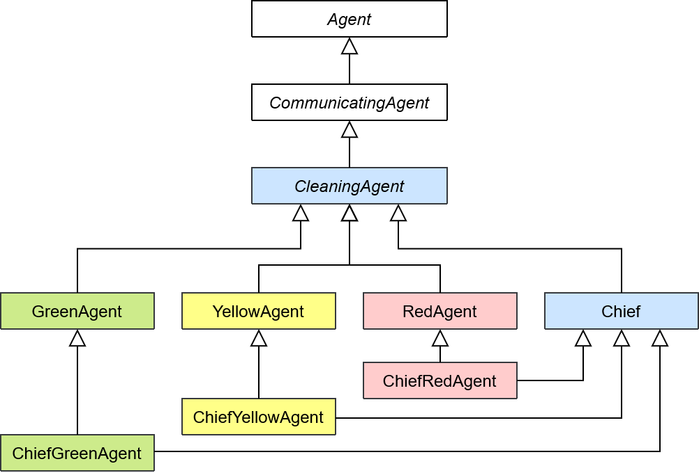

# Robot Mission - Group 3

This project has been created for the course SMA in CentraleSupélec.
The project has been realized by the group 3 composed of:
- Oumaima CHATER
- Laure-Emilie MARTIN
- Agathe PLU
- Agathe POULAIN

This `README` is composed of four main parts, the [first one](#installation) describing the steps to follow to install and run our code. The [second one](#without-communication) describes our implementation choices for non-communicating agent, whereas the [third one](#with-communication-and-improved-movement) deals with our implementation choices with communication between agents. The [fourth part](#simulations-results-interpretation) presents the results obtained for both approaches.

---

## Table of contents

- [Robot Mission - Group 3](#robot-mission---group-3)
  - [Table of contents](#table-of-contents)
  - [Installation](#installation)
    - [Cloning the repository](#cloning-the-repository)
    - [Creation of a virtual environment](#creation-of-a-virtual-environment)
    - [Installation of the necessary librairies](#installation-of-the-necessary-librairies)
    - [Launch the code](#launch-the-code)
  - [Our Objects](#our-objects)
    - [The Radioactivity](#the-radioactivity)
    - [The Waste](#the-waste)
    - [The WasteDisposalZone](#the-wastedisposalzone)
  - [Without Communication](#without-communication)
    - [Our Agents](#our-agents)
      - [The agent's knowledge](#the-agents-knowledge)
      - [The CleaningAgent](#the-cleaningagent)
      - [The GreenAgent](#the-greenagent)
        - [The deliberate method](#the-deliberate-method)
      - [The YellowAgent](#the-yellowagent)
        - [The deliberate method](#the-deliberate-method-1)
      - [The RedAgent](#the-redagent)
        - [The deliberate method](#the-deliberate-method-2)
    - [Our Model](#our-model)
    - [The scheduler](#the-scheduler)
    - [The visualization](#the-visualization)
  - [With Communication and improved movement](#with-communication-and-improved-movement)
    - [The knowledge](#the-knowledge)
      - [The Agent's knowledge](#the-agents-knowledge-1)
      - [The Chief's knowledge](#the-chiefs-knowledge)
    - [The agents](#the-agents)
      - [The CleaningAgent](#the-cleaningagent-1)
      - [The GreenAgent and the YellowAgent](#the-greenagent-and-the-yellowagent)
      - [The RedAgent](#the-redagent-1)
      - [The Chief](#the-chief)
      - [The ChiefGreenAgent](#the-chiefgreenagent)
      - [The ChiefYellowAgent](#the-chiefyellowagent)
      - [The ChiefRedAgent](#the-chiefredagent)
    - [Our Model](#our-model-1)
    - [The scheduler](#the-scheduler-1)
    - [The visualization](#the-visualization-1)
  - [Simulation's results interpretation](#simulations-results-interpretation)
    - [Without communication](#without-communication-1)
    - [With communication and improved movement](#with-communication-and-improved-movement-1)
  - [Conclusion and future perspectives for this work](#conclusion-and-future-perspectives-for-this-work)
    - [Areas for improvement](#areas-for-improvement)
    - [Perspectives](#perspectives)

---

## Installation

### Cloning the repository

To clone the github repository, you have to search the clone button on the main page of the project. Then click on it and select `https` or `ssh` depending on your favorite mode of connexion. Copy the given id and then open a terminal on your computer, go to the folder where you want to install the project and use the following command:

```bash
git clone <your copied content>
```

### Creation of a virtual environment

You might want to use a virtual environment to execute the code. To do so, use the following command:

```bash
python -m virtualenv venv
```

To start it, use the command on *Windows*:

```bash
./venv/Scripts/Activate.ps1
```

Or for *MacOS* and *Linux*:

```bash
source venv/Scripts/activate
```

### Installation of the necessary librairies

To execute this software, you need several *Python* librairies, specified in the `requirements.txt` file. To install them, use the following command:

```bash
pip install -r requirements.txt
```

### Launch the code

The grid size and the waste density are defined and can be modified in `tools/tools_constants.py`.


The main code can be launched by running the following command:

```bash
python run.py
```

It can also be launched with the visualisation by running the following command:

```bash
python server.py
```

---

## Our Objects

Our objects are agent types without any behavior, and they are defined in `objects.py`.

### The Radioactivity

The `Radioactivity` object represents the radioactivity of an area. It has two attributes:
- `zone`, which defines the area it belongs to and can only take three values ("z1", "z2", "z3")
- `radioactivity_level`, which defines its level of radioactivity. It is a random number comprised between 0 and 0.33 for z1, 0.33 and 0.66 for z2 and 0.66 and 1 for z3.

The `Radioactivity` object is placed in each cell of the grid to define our different areas. Its `zone` attribute then is used by our agents to determine which zone they are in.

### The Waste 

The `Waste` object represents the waste. It has one attribute: `type_waste` which defines the type of the waste and can only take three values ("green", "yellow", "red"). 

### The WasteDisposalZone

The `WasteDisposalZone` object represents a cell in the last right column of the grid, chosen randomly from the cells in that column.

---

## Without Communication

The following UML class diagram is explaining the inheritance links between all different types of agents.



### Our Agents

The implementation of our different cleaning agents is in the `agents.py` file.

#### The agent's knowledge

The `AgentKnowledge` class represents the knowledge and state of an agent in the simulation. This class is defined in `tools/tools_knowledge.py`. It has the following attributes:

- `grid_knowledge`: Represents the agent's knowledge of the grid. Its values are set to `0` for an empty tile, `1` for a green waste, `2` for a yellow waste, `3` for a red waste and `4` for the waste disposal zone. It is a numpy array with the same dimensions as the grid.
- `grid_radioactivity`: Represents the agent's knowledge of the grid's radioactivity. Its values are set to `1`, `2` or `3` according to the different zones. It is a numpy array with the same dimensions as the grid.
- `picked_up_wastes`: Represents a list of the Waste agents that our cleaning agent has picked up.
- `transformed_waste`: Represents whether the agent has transformed waste. Its values are `None` or the new transformed waste object.
- `left`, `right`, `up`, `down`: Boolean variables representing the possibility for the agent to move in the corresponding direction. It depends on the presence of an other agent in the agent's surrounding cells and on the limits of the grid.

The class provides methods to get and set these attributes. The __str__ method provides a string representation of the object's state.

#### The CleaningAgent

The `CleaningAgent` class inherits from the Mesa `Agent` class and is used to define common behaviors for the Green, Yellow and Red cleaning agents. These common behaviors are the methods `step`, `convert_pos_to_tile`, `update`, `update_positions_around_agent` and `update_knowledge_with_action`.

The `step` method implements the procedural loop of our agent. It begins by updating the agent's knowledge using the `update` method. Next, the `deliberate` method is called to return a list of possible actions. Finally, the `do` method is invoked in the environment to execute the chosen action.

The `convert_pos_to_tile` method takes as input a position and returns a direction (`left`, `right`, `up` or `down`) based on the agent's current location relative to the input position.

The `update` method updates each attributes of the agent's knowledge according to the percept.

The `update_positions_around_agent` method is used in the `update` method to update `left`, `right`, `up` and `down` boolean values of the agent's knowledge.

The `update_knowledge_with_action` method is used in the `update` method to update the knowledge of the agent given the action it has performed on the previous step. For instance, if the agent has transformed a waste, `transformed_waste` will be set to the transformed created waste contained the `percepts` returned by the model.

#### The GreenAgent

The `GreenAgent` is a class inheriting from the class `CleaningAgent` presented above. It permits to code the specific behavior of the green agent, mainly the `deliberate` method, which is not the same for all types of cleaning agents.

##### The deliberate method

The `deliberate` method returns a list of actions called `list_possible_actions`, in the order of preference for the agent. Only one will be executed by the model, the first of the list which can be executed.

The actions have been defined in `tools_constants` by strings. Here is the full list:
- `ACT_TRANSFORM`, to transform two wastes in a waste from the superior color
- `ACT_PICK_UP`, to pick up a waste
- `ACT_DROP`, to drop a transformed waste
- `ACT_GO_LEFT`, to go left
- `ACT_GO_RIGHT`, to go right
- `ACT_GO_UP`, to go up
- `ACT_GO_DOWN`, to go down
- `ACT_WAIT`, to wait

If the agent possesses two green wastes, the top priority action is to transform them.

If the agent possesses a yellow transformed waste, it will ask to go right until its right tile is on zone 2, ie the border. When it is on the border, it will ask to drop its waste if the current tile is empty, otherwise it will go up or down randomly, if nothing is blocking its way (thanks to the attributes `up` and `down` from knowledge). 

If the agent is on a tile with a green waste and if it doesn't have two wastes or a transformed waste, it will ask to perform the pick up action. If it cannot move or drop its waste, it will wait.

If the agent has less than two picked up wastes, no transformed waste and is on a cell containing a waste, then it will pick up the waste.

Otherwise, we will add moving to different directions if nothing blocks its way to its list of possible actions. We will favor adjacent cells with waste by adding them first in its list. Otherwise, possible directions are added in a random order.

The last action of the list will be to wait, so the agent always has an action to preform.

#### The YellowAgent

The `YellowAgent` is a class inheriting from the class `CleaningAgent` presented above. It permits to code the specific behavior of the yellow agent, mainly the `deliberate` method, which is not the same for all types of cleaning agents.

##### The deliberate method

It has the same behavior as the GreenAgent's deliberate method. One of the few differences is that it can move to the green area to pick up yellow waste at the border.

#### The RedAgent

The `RedAgent` is a class inheriting from the class `CleaningAgent` presented above. It permits to code the specific behavior of the red agent, mainly the `deliberate` method, which is not the same for all types of cleaning agents.

##### The deliberate method

This method's behavior is still quite similar to the tow other agents' deliberate methods. However, the red agents won't transform wastes, they will only pick up one waste and then put it in the waste disposal zone. To do so, it will go right after picking up a waste and then move up or down to join the waste disposal zone whose position is stored in the agent's knowledge.

### Our Model

The implementation of our model is in the `model.py` file. The `RobotMission` class inherits from the Mesa `Model` class and defines the RobotMission model itself, and uses the agents, the scheduler and the environment. 

We begin by defining several methods to set up the grid and all agents: `init_grid`, `init_wastes` and `init_agents`.

TODO - Agathe Poulain => expliquer le datacollector

In `init_grid` we establish the position of the waste disposal zone and created  `Radioactivity` objects in every cells of the grid except at the waste disposal zone position, where we created a `WasteDisposalZone` object.

In `init_wastes` we create all wastes. To do so, we first define the total number of wastes in the grid (grid height * grid width * waste density, the density is set in `tools/tools_constants.py`) and the number of cells per zone (grid width/3 * grid height). We then randomly place green, yellow and red wastes in their respective zones. However, we do not initially place a red waste in the waste disposal zone.

- The number of green wastes is randomly determined within a range. The upper bound of this range is the minimum between the number of cells in the green area and the total number of wastes. The lower bound is the maximum between 0 and the total number of waste minus the total number of cells in the rest of the grid. This allocation ensures that wastes are placed in the zone if the other two areas do not have sufficient space to accommodate all remaining wastes. Then we check if that number is even so that we can clean the whole map. Otherwise we add or subtract one green waste.

- The number of yellow wastes is randomly determined within a range. The upper bound of this range is the maximum between 0 and the minimum between the remaining wastes and the number of cells in the zone. The lower bound is the maximum between 0 and the total number of waste minus the total number of cells in the rest of the grid. This allocation ensures that waste can be placed in the zone if the red area does not have sufficient space to accommodate all remaining wastes. Then we check if that number plus the number of green wastes' pairs is even, otherwise we add or subtract one yellow waste.

- The number of red wastes is determined by the number of remaining wastes to place.

In `init_agents` we create and place the cleaning agent according to their colors and respective areas. We choose to initially place cleaning agent in their color zone. We also do not allow two agents to be in the same cell, this will stay true during the simulations.

The `step` method does the scheduler step while there are still wastes to clean up, otherwise the simulation will terminate.

The `run_model` method executes the `step` method for a given number of sSteps.

The `do` method takes as arguments the agent performing the action and the list of all possible actions. It iterates through this list, checking if the current action is feasible. If it is feasible, the method breaks, ensuring that only one action is performed. If the current action is not feasible, the method moves on to the next action in the list. When an action is performed using the `do` method, the method also executes the changes associated with that action:
- `ACT_TRANSFORM`, if the agent is a `GreenAgent` it creates a green waste, if the agent is a `YellowAgent` it creates a red waste. It then adds the transformed created waste to the scheduler. It also removes from the scheduler the two wastes from the agent's knowledge `picked_up_waste`.
- `ACT_PICK_UP`, it removes the waste agent from the grid.
- `ACT_DROP`, if the agent is not a `RedAgent` the transformed waste will be placed on the grid. If the agent is a `RedAgent` it will remove the picked_up_waste from the scheduler.
- `ACT_GO_LEFT`, it will check for another agent in the left cell and move the agent if it is empty.
- `ACT_GO_RIGHT`, it will check for another agent in the right cell and move the agent if it is empty.
- `ACT_GO_UP`, it will check for another agent in the upper cell and move the agent if it is empty.
- `ACT_GO_DOWN`, it will check for another agent in the lower cell and move the agent if it is empty.
- `ACT_WAIT`, it waits.

The `do` method returns the percepts. It is a dictionary of two mains keys: `action_done` and `positions`. The first key is associated with a dictionary containing the key `action` associated to the constant representing the action executed and `object` if the agent has picked up a waste or transformed it. The second key is a dictionary with four keys: left, right, up and down. It either contains a list of agents (`Waste`, `Radioactivity`, other cleaning agents and `WasteDisposalZone`) in the surrounding cells or `None` if the cell does not exist (grid limits). This percepts is created after the action is performed to take into account the possible new position of the agent.

### The scheduler

A custom class of random scheduler `CustomRandomScheduler` has been defined in the file `schedule.py`. This new class inherits from the base class of *mesa* `BaseScheduler`, but its `step()` function is slightly modified to activate the cleaning agents in a random order, according to their type. More precisely, the order of activation of the types of agents is random (random between green, yellow and red), and for each type, the order of activation of agents is random.

### The visualization

The visualization is defined in the `server.py`. Each agent and object is there represented according to the following codes:
- the `Radioactivity` objects are rectangles in the layer 0 in the corresponding color (light green, light yellow, light red): they map the grid.
- the `WasteDisposalZone` object is a brown rectangle in the layer 1.
- the `Waste` objects are small rectangles in the corresponding color (green, yellow, red), in the layer 2.
- the `CleaningAgent` are represented by circles in the layer 3 in the corresponding colo  (dark green, dark yellow, dark red). When they have one or two wastes on them, the number of wastes is display in the circle. When they have a transformed waste on them, the letter "T" is displayed in the circle.

---

## With Communication and improved movement

We worked from the previous part to add communication between our agent and we improved their movement. In this new part, we will develop all implemented changes and enhancements.

The key points are the covering mode at the beginning of the cleaning to identify all wastes in the map, and the creation of a Chief for each color agents. This Chief is in charge of centering the knowledge (for each color agents), managing its agents for the new covering phase and sending appropriate orders. For this purpose, we create a new super class `Chief` and we create a dedicated `ChiefKnowledge` class in `tools/tools_knowledge.py`. We will now delve into our implemented improvements: the code is based on the previous part, hence, we will only mention deleted, changed and/or added behaviors in this part.

### The knowledge

For our communication, we choose to extend our agents' knowledge by incorporating additional elements. We also created a dedicated `ChiefAgentKnowledge` class inheriting from our `AgentKnowledge` class.

#### The Agent's knowledge

We added several attributes to our inital `AgentKnowledge` class, including:

- `dict_chiefs` : A dictionary containing the chief agents for each color.
- `target_position` : Represents the target position to reach, which can be None or a position tuple.
- `bool_covering` : Boolean variable representing whether the agent is in covering mode or not, initialized at `True`.
- `direction_covering` : Represents the direction to cover, initialized at `None` and can take values `right` or `left`.
- `bool_stop_acting` : Boolean variable representing whether the agent is in waiting mode (its zone is cleaned) or not.

#### The Chief's knowledge

The `ChiefAgentKnowledge` class inherits from the `AgentKnowledge` class and includes additional attributes:

- `dict_agents_knowledge` : A dictionary containing the agents' knowledge.
- `bool_cleaned_right_column` : Boolean variable representing whether the Chief's zone's rightmost column has been cleaned. Indeed, the green and yellow chiefs will start cleaning the rightmost column of their zone, in order to allow easier drop of transformed waste on the border.
- `direction_clean_right_column` : Represents the direction to clean, initialized at `None` and can take values `up` or `down`.
- `rows_being_covered` : A list of size equal to the grid height, containing 1 if the row is being covered or has been covered, and 0 otherwise.
- `list_green_yellow_red_left_columns` : A list of three values, initialized at `None`, representing the columns of the leftmost columns in the green, yellow, and red zones.
- `list_green_yellow_red_right_columns` :  A list of three values, initialized at `None`, representing the id of columns of the rightmost columns in the green, yellow, and red zones.
- `dict_target_position_agent` : A dictionary containing the target positions given to each agent.
- `bool_previous_zone_cleaned` : Boolean value representing whether the previous zone is totally cleaned or not (if the green area is cleaned for yellow agents or if the yellow are is cleaned for red agents).

The class provides methods to get and set these attributes. The __str__ method provides a string representation of the object's state.

### The agents

The principle beyond the behavior of each agent given its type (chief or not) and its color is the following:
- at the beginning of the simulation, the green and yellow chiefs go to the rightmost column of their zone to clean it, to allow futur easier drop of the transformed wastes. The other agents (including the red chief) will start to cover their own zone, so each tile of their zone has been seen at least once. It will be done accordingly to the following image.

Each agent will place himself to the target position indicated by the chief to perform the coverage of the row (and the two adjacent rows at the same time through its percept); this row is chosen by being the closest non covered row to the agent. The agents performing the coverage can pick up wastes during their covering if the waste is on their way. Nevertheless, they cannot derive from their row and their target position to pick a close waste or drop a transformed waste (they can drop it only if during their covering phase they go to the last column, which is not always the case). 
- after all rows have been covered, the agents will receive new orders from their chief, indicating the position of the closest waste to the agent (the chief will also receive this kind of orders from himself). The agent will thus go to this target; if he finds a waste on his way, he can pick it and warn the chief of this action. When the agent has a transformed waste, it goes right (and indicates the chief he canceled his target if he still had one) to drop it on the last column. This principle is the same for red agents with the waste disposal zone.
- at the end of the cleaning of the green or yellow zone, some blocking situations can exist. For instance, if the two last green wastes have been picked up by different agents. To overcome this dead-end, we added a special action `ACT_DROP_ONE_WASTE` and we used communication; the chief will send a message to one of the agents to drop its waste and let the other agent pick it.

The following UML class diagram is explaining the inheritance links between all different types of agents.


#### The CleaningAgent

The `CleaningAgent` class inherits from the `CommunicatingAgent` class defined in `communication/agent/CommunicatingAgent.py` and is used to define common behaviors for the Green, Yellow and Red cleaning agents and their chiefs. These common behaviors are the methods `step`, `convert_pos_to_tile` (same as part 1), `treat_order`, `receive_orders`, `get_specificities_type_agent`, `can_drop_transformed_waste`, `can_drop_one_waste`, `can_transform`, `can_pick_up`, `can_go_up`, `can_go_down`, `can_go_right`, `can_go_left`, `deliberate_go_to_pick_close_waste`, `deliberate_go_to_target`, `deliberate_covering`, `deliberate_stop_acting`, `send_message_disable_target_position`, `update_knowledge_target_position`, `update_knowledge_with_action`, `update` and `send_percepts_and_data`.

In the `step` method, we implement the improved procedural loop of our agent. We start by receiving orders from the chief with `receive_orders`. We then call the `deliberate` and `do` methods, followed by the `update` method. Finally, the step is finished by the agent sending its percept and data to the chief using `send_percepts_and_data`. We chose to move the `update` method after the `deliberate` and `do` methods as this new order best fits our implementation and our needs.

The `treat_order` method defines the agent's action corresponding to received orders from its chief. The message reception of the agent is defined in the `receive_orders` method.

The `get_specificities_type_agent` method is often used in our code as it returns specific values depending on the agent's type (*i.e.*, its color). It returns the maximum number of waste items that can be picked up (2 for green and yellow, 1 for red agents), the type of waste that can be picked up (1 for green, 2 for yellow, 3 for red agents), and the type of the right (2 for green, 3 for yellow and None for red agents) and left (None for green, 1 for yellow and 2 for red agents) zones for the agent.

The methods `can_drop_transformed_waste`, `can_drop_one_waste`, `can_transform`, `can_pick_up`, `can_go_up`, `can_go_down`, `can_go_right`, `can_go_left` each return a boolean value indicating whether the agent can perform the corresponding action. We verify all conditions in these functions and define them to simplify and clean our code. We use them in various `deliberate` functions in our program.

The `deliberate_go_to_pick_close_waste` method defines the agent's behavior whether there are wastes in its surrounding cells. It then adds the action of going to these directions in the list of available actions if the agent can perform the action (by using the previously described methods).

The `deliberate_go_to_target` method defines the agent's behavior when it has a target position to reach. We prioritize actions such as dropping (if in the rightmost column), picking up, or transforming waste. If the agent is not in covering mode, we allow it to pick up a nearby waste by using the previously defined deliberate method. To reach the target position, we first move the agent to the correct column and then to the correct row, ultimately reaching the desired position. We also handled a specific case: when the target position had a row ID but not a column ID. This occurs in the covering phase when the chief does not know the exact size of its area. In this case, the agent moves to the right until it detects the end of its zone, after which it moves to the correct row.

The `deliberate_covering` method defines the agent's behavior during the covering phase. We prioritize actions such as dropping (if in the rightmost column), picking up, or transforming waste. Using the `direction_covering` attribute of the agent, the agent covers its row in the correct direction. The function also defines a small avoidance strategy : if blocked by another agent, the agent will move randomly in its current row.

The `deliberate_stop_acting` method defines the agent's behavior before it stops moving. It needs to drop its last waste before stopping, it cannot stop on a cell containing a waste and it cannot stop in a cell on the rightmost or leftmost columns.

The `send_message_disable_target_position` methods is defined to allow the agent to notify its chief when it decides to not pursue its assigned target position. This can append in normal mode if the agent now has a transformed waste to drop, for instance.

The `update_knowledge_target_position` method modifies the agent's knowledge: its target position is set back to None when reached and if the agent is in covering mode, directions to cover are set according to its current position.

The `update_knowledge_with_action` method defines which attributes to update in the agent's knowledge depending on the action it has performed. The `update` method updates the agent's knowledge based on the agent's percepts after performing its action.

At the end of the step, the `send_percepts_and_data` method is used by the agent to send its latest percepts and knowledge to its chief.

#### The GreenAgent and the YellowAgent

Their new deliberate methods uses the various deliberate methods defined in the `CleaningAgent` class. We call these deliberate methods by using all previously defined boolean values specifying the behavior phases of our agents.

The difference between the `GreenAgent` and `YellowAgent` deliberate method resides in the authorized zone and type of waste to pick up. Also, the `YellowAgent` can still go to the green area to pick up yellow waste.

#### The RedAgent

The `RedAgent` deliberate method is quite similar to the green's and yellow's one, except that the red agents will go to the waste disposal zone to drop waste one by one.

#### The Chief

The `Chief` class inherits from the `CleaningAgent` class, and is used to define common behaviors for the `ChiefGreenAgent`, `ChiefYellowAgent` and `ChiefRedAgent`. These common behaviors are the methods `step`, `receive_messages`, `determine_covering`, `update_target_position_list_orders`, `update_chief_with_agents_knowledge`, `send_information_according_to_previous_actions`, `update_chief_information_knowledge`, `find_best_rows_to_cover`, `send_orders_covering`, `find_closest_waste_to_agent`, `send_target_orders`, `send_orders_stop_acting`, `send_orders`, `deliberate_cover_last_column`, `deliberate`, `get_green_yellow_red_left_column`, `get_green_yellow_red_right_column`, `update_left_right_column` and `update`.

In the `step` method, we implement the procedural loop of our chief. We start by receiving messages from the other chiefs and its agents with `receive_messages`. We then call the `update_chief_with_agents_knowledge`, `send_information_according_to_previous_actions` and `update_chief_information_knowledge` methods to update the chief knowledge and send information to other chiefs. Then, `send_orders` and `receive_orders` methods are called to send accurate orders to its agents and himself, and to receive its own orders for the step. Finally, the `deliberate` and `do` methods are called, followed by the `update` method.

The `receive_messages` method defines the messages reception of the chief. It receives messages from its agents and from the other chiefs.

The `determine_covering` method determines if the chief needs to cover the grid. It is only used for green and yellow chiefs: if they are the only green or yellow agent, they will need to cover their whole zone, otherwise they will only clean the rightmost column of their area.

The `update_target_position_list_orders` method updates the chief knowledge of given target positions. It is updated if the target position has been reached or if it has been canceled by the agent.

The `update_chief_knowledge_with_agents_knowledge` method defines how the chief centralized the knowledge by using the sent percepts of its agents. The chief's knowledge of the grid and radioactivity is updated at every step with information provided by its agents. The chief also stores the position, number of picked up wastes, the transformed waste and mode (through our various boolean values) of each of its agents.

The `send_information_according_to_previous_actions` method defines how the chief send relevant information to the superior chief (to the yellow chief for the green one and to the red one for the yellow chief). The chief informs the other chief when a transformed waste is dropped at the border and when its current zone is totally cleaned.

The `update_chief_information_knowledge` method updates the chief knowledge with data received from the other chiefs : position of dropped waste at the border and the position of the border.

The `find_best_rows_to_cover` method finds relevant rows for all agents to cover. First, the second and penultimate rows are attributed as we want to make sure to cover the corners of the grid (for instance, by covering the second row, the first and the third rows are also covered in the same time). Then, the remaining rows are attributed to the closest agents, making sure to optimize the number of rows covered (3 rows all at once, then 2 rows all at once in the grid height is not divisible by 3). Then, the `send_orders_covering` method defines the way the chief sends order to its agent during their covering modes. The chief will send them location of rows to cover using the previously defined method, if they are not currently covering a row or reaching a target position.

The `find_closest_waste_to_agent` method finds the closest waste to each agent among the known wastes positions in the chief's knowledge of the grid.

The `send_target_orders` is used in `send_orders` and defines how the chief sends orders to its agents to go to a target position. It can send those orders if the agent can act and is not covering. If the chief is sending a target order to himself, he must not be covering, the grid or the rightmost column.

The `send_orders_stop_acting` method defines how and when the chief send to its agents (and himself) the order to stop acting. This order is sent to the agent if the agent is not static (i.e., the chief will send this order only once to each agent) and if it does not have picked up or transformed wastes. For the ending scenario where two agent have picked up the two last remaining wastes, the chief will order on of them to drop its waste and will attribute the dropped location as target position to the second one.

The `send_orders` regroup all send orders methods and is the one called in the `step` method.

The `deliberate_cover_last_column` method determines all possible actions for the chief during its cleaning of the rightmost column (hence, only for green and yellow chiefs.) We move the chief to the upper or lower right corner of its area based on its initial vertical position. Then, we move it up or down according to its position to clean the column (picking up, transforming and dropping wastes).

The`deliberate` method calls the previously defined method if the chief has not finished to clean the rightmost column and its mothers classes deliberate functions otherwise.

The `get_green_yellow_red_left_column` and `get_green_yellow_red_right_column` are respectively defined to return the first (leftmost) and last (rightmost) column of each area. They are then called in the `update_left_right_column` method. In this method, the left and right columns of the chief's zone are updated in its knowledge.

Finally, the `update` method is used to update the chief's knowledge during the initial phase : while the rightmost column is not cleaned.

#### The ChiefGreenAgent

The `ChiefGreenAgent` inherit from our `Chief` and `GreenAgent` classes. In its init method, we initiate its `bool_covering` attribute as false, as our green chief has, by default, to clean its rightmost column. We also set its `bool_previous_zone_cleaned` as true : the previous zone for green agents (i.e. None) is already cleaned.

#### The ChiefYellowAgent

The `ChiefYellowAgent` inherit from our `Chief` and `YellowAgent` classes. In its init method, we initiate its `bool_covering` attribute as false, as our yellow chief has, by default and as the green chief, to clean its rightmost column. 

#### The ChiefRedAgent

The `ChiefRedAgent` inherit from our `Chief` and `RedAgent` classes. In its init method, we initiate its `bool_covering` attribute as true, as our red chief has no rightmost column to clean : it is in covering mode in the begining as all other red agents.

### Our Model

We improved a few things in the model class. 

First of all, we took into account the configurations where the grid width is not divisible by 3. In these cases, we attributed the one or two columns remaining to one or two zones randomly. For instance, for a grid width of 20, the green zone can have 7 columns, the yellow 6 and the red 7, at random.

Moreover, we implemented the `MessageService` class to enable the communication between agents. We also added the number of send messages in the `DataCollector`, differentiating the chief-to-chief, agent-to-chief and chief-to-agent messages.

Finally, we added the termination condition with `self.running = False` all red agents have their `bool_stop_acting` set to True. It thus no longer the model which determines if the simulation is over by checking if there is no longer wastes, but the agents themselves which say they have finished their job. This is closer to a real case simulation.

### The scheduler

We improved the class `CustomRandomScheduler` by adding the chiefs in the `step` method. We choose to call the chiefs before the agents of their respecting colors, to allow them to distribute orders always at the beginning of the step.

### The visualization

We improved the visualization by adding *mesa* sliders to enable the user to configure the simulation directly on the interface. The user can choose the number of green, yellow and red agents, and also the waste density.

We also added clearer images for each type of object. We distinguished chiefs from agent for each color with specific images, and we also chose an image for the wastes and the waste disposal zone. All of these images are located in the folder `resources/`.

---

## Simulation's results interpretation

To compare both approaches presented above, mostly to analyse the improvements made in the second method, we decided to run many simulations for both cases and compare the terminating rate of simulations (for non communication approaches, the simulation may not terminate), and the average number of steps needed to clean the entire map. For each test, we use (9, 18) as grid size and 0.3 for the waste density.

Only the number of agents per zone evolves across simulations, and for each case we have launched 10 simulations to be able to compute a correct average. Without communication, we launched simulations for 1 agent per zone, 2 and 3 agents per zone. With communication, we launched for 1, 2, 3 and 4 agents per zone. Doing it for 4 agents per zone without communication was useless as the simulation is almost never terminating in this case.

### Without communication

To analyse the performance of the model without communication, we launched 30 simulations corresponding to:
- Simulations 1 to 10 : 1 agent per zone
- Simulations 11 to 20 : 2 agents per zone
- Simulations 21 to 30 : 3 agents per zone

Here is the table with all the results:


When there is only one agent per zone (blue cells on the previous picture), the average number of steps to complete the cleaning of the map is 1346.

When there are two agents per zone (green cells on the previous picture), the average number of steps to complete the cleaning of the map is 713. It is almost two times less than the average number of steps needed with one agent per zone. However, half of the simulations launched with two agents did not end because two agents of the same zone picked up one waste left at the end of their zone cleaning and blocked themselves from transforming the waste into a new one.

When there are three agents per zone (purple cells on the previous picture), the average number of steps to complete the cleaning of the map is 404. It is almost three times less than the average number of steps needed with one agent per zone. However, 6 out of 10 simulations launched did not end because two agents of the same zone picked up one waste left at the end of their zone cleaning and blocked themselves from transforming the waste into a new one.

According to these results, we can conclude that, on one hand, the higher the number of agents per zone, the fewer steps needed to clean the map. On the other hand, the higher the number of agents per zone, the higher the number of simulations that could not be terminated because of a conflict between two agents at the end of their zone cleaning. Therefore, we want to add communication between the agents to optimize the cleaning of the map and avoid non-terminated simulations.

You can see in appendix in `results/graphics_without_communication` the graphs obtained at the end of each of the simulations previously studied and indicating the number of waste remaining per zone at the end of the simulation. 

### With communication and improved movement

To analyse the performance of the model with communication, we launched 40 simulations corresponding to:
- Simulations 1 to 10 : 1 agent per zone
- Simulations 11 to 20 : 2 agents per zone
- Simulations 21 to 30 : 3 agents per zone
- Simulations 31 to 40 : 4 agents per zone

Here is the table with all the results:

TODO

---

## Conclusion and future perspectives for this work

TODO : (en se basant sur la partie des résultats de pt2 (je peux le faire en rentrant demain soir))

### Areas for improvement

While we are satisifed with our implementation to solve the problem, we have identified a few possible improvements in our implementation.

First of all, our chief currently sends picking up target position to our agents, but it could also send dropping cells positions to our agent. These cells would be calculated to be the closest to the agent. This could be done by using the chief's knowledge, which contains all waste position in its grid (thanks to the covering phase) and the current emptied cell in the rightmost column, obtained in messages from its superior chief. To do so, we would add the `drop_target_position` in the knowledge and rename our current `target_position` to `pick_up_target_position`.

We could then enhance this behavior for our yellow agents : the dropping position could be determine to be as close as possible to the waste dispozal zone (while remaining in the rightmost column of course), which would give easier jobs to the red agents.

- TODO (?): beaucoup de messages envoyés, surtout de chef à agent mais ça c'est parce qu'il y a bcp d'ordres. On aurait pu demander aux agents d'arrêter d'envoyer leur percept et data au chef s'ils sont en mode stop.

Our last area for improvement lies in addressing potential dead-end situations caused by our strict movements, particularly when many agents are involved. Implementing a more flexible movement strategy could help reduce the occurence of these issues, thereby ensuring smoother and more efficient solving of the initial problem.

### Perspectives

In our context of hierarchy (chiefs and their working agents) we can imagine one of our chief agents to become unresponsive, leading to the need for a new chief to be elected. A solution could involve implementing a confirmation message system: for instance, if the chief agent fails to respond to messages sent by its agents, a confirmation message could be required from the chief each time it receives the agent's percepts. This method ensures that the chief remains active, facilitating the smooth operation of our overall system.

This particular case became possible when we consider the radioactivity impact on our agents. It can easily be imagined that the radioactivity,defined at every cell by our `Radioactivity` object with diversified levels, can affect and slowly deteriorate our agents. Consequently, xe will have to deal with cases of unresponsive agents, including our chiefs.
